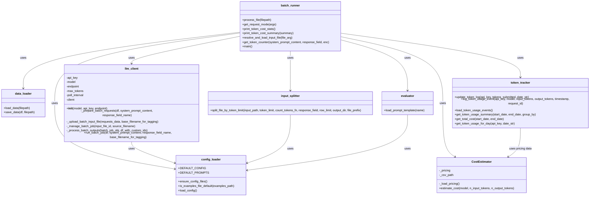

# BatchGrader Application Flow Diagram

This document provides a visual representation of the BatchGrader application's architecture and flow as of v0.2.6-pre

## Component Diagram

## Sequence Diagram (Main Flow)

## Data Flow Diagram

## Component Descriptions

1. **batch_runner.py**: The main entry point of the application. Handles CLI arguments, processes input files, and orchestrates the workflow.

2. **config_loader.py**: Loads configuration from config.yaml and provides default values.

3. **data_loader.py**: Handles loading and saving data in different formats (CSV, JSON, JSONL).

4. **evaluator.py**: Loads prompt templates from prompts.yaml.

5. **input_splitter.py**: Splits input files into parts that do not exceed a specified token or row limit.

6. **llm_client.py**: Interacts with the OpenAI Batch API to submit batch jobs and process results.

7. **token_tracker.py**: Tracks and aggregates OpenAI API token usage for both API limit enforcement and historical/cost tracking.

8. **cost_estimator.py**: Estimates API costs based on the pricing data in docs/pricing.csv.

## Configuration Files

1. **config.yaml**: Contains configuration parameters like input/output directories, model name, token limits, etc.

2. **prompts.yaml**: Contains prompt templates for evaluation.

3. **examples.txt**: Contains examples of the target style for contextual evaluation.

4. **pricing.csv**: Contains pricing data for different OpenAI models.

## Workflow Modes

1. **Count Tokens**: Counts tokens in input files and displays statistics.

2. **Split Tokens**: Splits input files into parts that do not exceed the configured token limit.

3. **Batch Processing**: Processes input files using the OpenAI Batch API, saves results, and displays statistics.