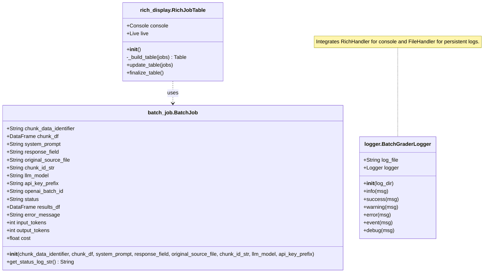
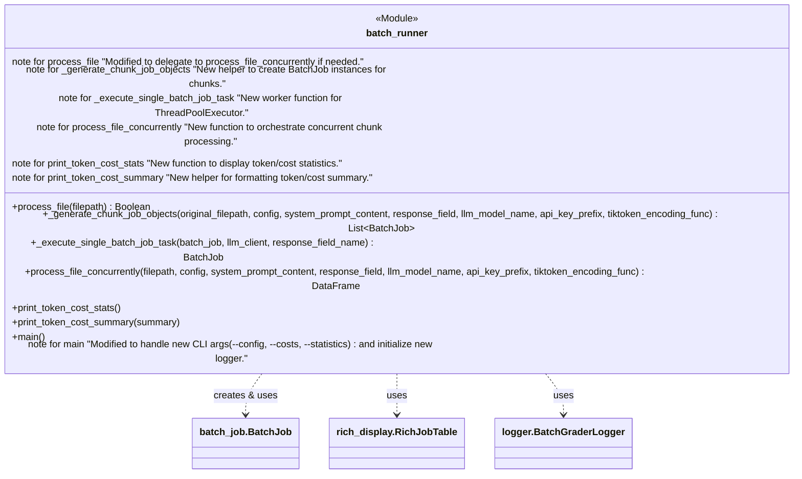
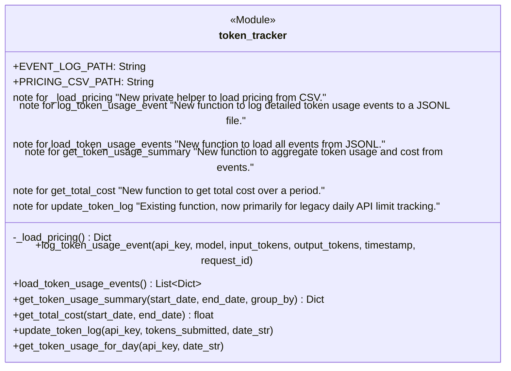
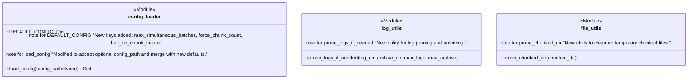

# BatchGrader Visualizations

## *Version: v0.3.1*

## Overview

BatchGrader is a modular Python application for batch evaluation of text data using the OpenAI Batch API. It features YAML-based configuration, prompt management, flexible input/output support, and robust cost estimation.

---

```mermaid
graph TD
    %% ENTRY POINT & INITIALIZATION - Vertical flow
    A["User executes batch_runner.py via CLI"] --> B["src/batch_runner.py: Main Entry Point"]
    B --> C1["log_utils.py: Prune Old Logs"]
    C1 --> C2["logger.py: Setup Logging"]
    C2 --> C2a["Console Output via Rich"]
    C2 --> C2b["File Logging"]
    C2b --> C3["config_loader.py: Load Configs"]
    C3 --> C3a["config.yaml"]
    C3 --> C3b["prompts.yaml"]
    
    %% MODE SELECTION - Central decision point
    C3b --> D["Parse CLI Arguments"]
    
    %% BRANCH 1: COSTS MODE - Vertical flow
    D --> D1["--costs Flag"]
    D1 --> E1["token_tracker.py: Retrieve Usage"]
    E1 --> E2["cost_estimator.py: Calculate Costs"]
    E2 --> E3["Display Token/Cost Statistics"]

    %% BRANCH 2: TOKEN COUNT MODE - Vertical flow
    D --> D2["--count-tokens Flag"]
    D2 --> F1["resolve_and_load_input_file()"]
    F1 --> F2["data_loader.py: Load Data"]
    F2 --> F2a["Input Files (CSV/JSON/JSONL)"]
    F2a --> F3["evaluator.py: Prepare Prompt"]
    F3 --> F3a["prompts.yaml"]
    F3 --> F3b["examples.txt (Optional)"]
    F3b --> F4["tiktoken: Count Tokens"]
    F4 --> F5["Display Token Statistics"]
    
    %% BRANCH 3: SPLITTING MODE - Vertical flow
    D --> D3["--split-tokens Flag"]
    D3 --> G1["resolve_and_load_input_file()"]
    G1 --> G2["data_loader.py: Load Data"]
    G2 --> G2a["Input Files (CSV/JSON/JSONL)"]
    G2a --> G3["input_splitter.py: Split Files"]
    G3 --> G4["Output Chunked Files"]

    %% BRANCH 4: BATCH PROCESSING MODE - Vertical flow with decision
    D --> D4["Default (Batch Process)"]
    D4 --> H1["resolve_and_load_input_file()"]
    H1 --> H2["data_loader.py: Load Data"]
    H2 --> H2a["Input Files (CSV/JSON/JSONL)"]
    H2a --> H3["evaluator.py: Prepare System Prompt"]
    H3 --> H3a["Load Prompt Template"]
    H3 --> H3b["Load Examples (Optional)"]
    H3b --> H4["process_file()"]
    H4 --> H5{"Is Config force_chunk_count > 1\nor Large File?"}
    
    %% CHUNKED PROCESSING PATH - Vertical flow
    H5 --"Yes"--> H6["process_file_concurrently()"]
    H6 --> H7["_generate_chunk_job_objects()"]
    H7 --> H8["Input Chunked Files"]
    H8 --> H9["BatchJob Objects Created"]
    H9 --> H10["ThreadPoolExecutor: Parallel Processing"]
    H10 --> H11["_execute_single_batch_job_task() for each chunk"]
    H11 --> H12["LLMClient.run_batch_job()"]
    H12 --> H13["OpenAI Batch API"]
    H13 --> H14["rich_display.py: Update Live Job Table"]
    H14 --> H15["Aggregate Chunk Results"]
    H15 --> H16["data_loader.py: Save Results"]
    H16 --> H17["token_tracker.py: Record Usage"]
    H17 --> H18["cost_estimator.py: Calculate Costs"]
    H18 --> H19["Final Summary"]
    
    %% DIRECT PROCESSING PATH - Vertical branch
    H5 --"No"--> H20["Prepare Single Batch"]
    H20 --> H21["LLMClient.run_batch_job()"]
    H21 --> H13r["OpenAI Batch API"]
    H13r -.-> H13
    H13r --> H22["Process Results"]
    H22 --> H16r["data_loader.py: Save Results"]
    H16r -.-> H16

    %% STYLING - DARK MODE
    style A fill:#2d4f2d,stroke:#88cc88,stroke-width:2px
    style B fill:#1a3a4a,stroke:#88aaee,stroke-width:2px
    style C1 fill:#1a3a4a,stroke:#88aaee,stroke-width:2px
    style C2 fill:#1a3a4a,stroke:#88aaee,stroke-width:2px
    style C2a fill:#1a3a4a,stroke:#88aaee,stroke-width:1px
    style C2b fill:#1a3a4a,stroke:#88aaee,stroke-width:1px
    style C3 fill:#1a3a4a,stroke:#88aaee,stroke-width:2px
    style C3a fill:#1a3a4a,stroke:#88aaee,stroke-width:1px
    style C3b fill:#1a3a4a,stroke:#88aaee,stroke-width:1px
    
    %% Mode selection
    style D fill:#324a32,stroke:#a0d0a0,stroke-width:2px
    style D1 fill:#324a32,stroke:#a0d0a0,stroke-width:1px
    style D2 fill:#324a32,stroke:#a0d0a0,stroke-width:1px
    style D3 fill:#324a32,stroke:#a0d0a0,stroke-width:1px
    style D4 fill:#324a32,stroke:#a0d0a0,stroke-width:1px
    
    %% Mode 1: Costs
    style E1 fill:#2a3a4a,stroke:#88aacc,stroke-width:1px
    style E2 fill:#2a3a4a,stroke:#88aacc,stroke-width:1px
    style E3 fill:#2a3a4a,stroke:#88aacc,stroke-width:1px
    
    %% Mode 2: Token Counting
    style F1 fill:#2a382a,stroke:#88aa88,stroke-width:1px
    style F2 fill:#2a382a,stroke:#88aa88,stroke-width:1px
    style F2a fill:#362a4a,stroke:#c0a0ff,stroke-width:1px
    style F3 fill:#2a382a,stroke:#88aa88,stroke-width:1px
    style F3a fill:#2a382a,stroke:#88aa88,stroke-width:1px
    style F3b fill:#2a382a,stroke:#88aa88,stroke-width:1px
    style F4 fill:#2a382a,stroke:#88aa88,stroke-width:1px
    style F5 fill:#2a382a,stroke:#88aa88,stroke-width:1px
    
    %% Mode 3: Splitting
    style G1 fill:#2d2a3a,stroke:#aa88cc,stroke-width:1px
    style G2 fill:#2d2a3a,stroke:#aa88cc,stroke-width:1px
    style G2a fill:#362a4a,stroke:#c0a0ff,stroke-width:1px
    style G3 fill:#2d2a3a,stroke:#aa88cc,stroke-width:1px
    style G4 fill:#2d2a3a,stroke:#aa88cc,stroke-width:1px
    
    %% Mode 4: Batch Processing
    style H1 fill:#3a2a2a,stroke:#cc8888,stroke-width:1px
    style H2 fill:#3a2a2a,stroke:#cc8888,stroke-width:1px
    style H2a fill:#362a4a,stroke:#c0a0ff,stroke-width:1px
    style H3 fill:#3a2a2a,stroke:#cc8888,stroke-width:1px
    style H3a fill:#3a2a2a,stroke:#cc8888,stroke-width:1px
    style H3b fill:#3a2a2a,stroke:#cc8888,stroke-width:1px
    style H4 fill:#3a2a2a,stroke:#cc8888,stroke-width:1px
    style H5 fill:#4a332d,stroke:#dda088,stroke-width:2px
    
    %% Chunked Path
    style H6 fill:#3a2a2a,stroke:#cc8888,stroke-width:1px
    style H7 fill:#3a2a2a,stroke:#cc8888,stroke-width:1px
    style H8 fill:#3a2a2a,stroke:#cc8888,stroke-width:1px
    style H9 fill:#3a2a2a,stroke:#cc8888,stroke-width:1px
    style H10 fill:#3a2a2a,stroke:#cc8888,stroke-width:1px
    style H11 fill:#3a2a2a,stroke:#cc8888,stroke-width:1px
    style H12 fill:#3a2a2a,stroke:#cc8888,stroke-width:1px
    style H13 fill:#4a2933,stroke:#ffaacc,stroke-width:2px,stroke-dasharray: 5 5
    style H14 fill:#4a4a20,stroke:#dddd88,stroke-width:1px
    style H15 fill:#3a2a2a,stroke:#cc8888,stroke-width:1px
    style H16 fill:#3a2a2a,stroke:#cc8888,stroke-width:1px
    style H17 fill:#3a2a2a,stroke:#cc8888,stroke-width:1px
    style H18 fill:#3a2a2a,stroke:#cc8888,stroke-width:1px
    style H19 fill:#3a2a2a,stroke:#cc8888,stroke-width:1px
    
    %% Direct Path
    style H20 fill:#2a3a3a,stroke:#88cccc,stroke-width:1px
    style H21 fill:#2a3a3a,stroke:#88cccc,stroke-width:1px
    style H13r fill:#4a2933,stroke:#ffaacc,stroke-width:2px,stroke-dasharray: 5 5
    style H22 fill:#2a3a3a,stroke:#88cccc,stroke-width:1px
    style H16r fill:#2a3a3a,stroke:#88cccc,stroke-width:1px
```

```mermaid
---
config:
  layout: fixed
  theme: neo-dark
---
flowchart TD
 subgraph 1053["Input/Output Data Storage (Application Directory)"]
        1077["Input Data Files<br>User-provided Files"]
        1078["Output Data Files<br>Generated Files"]
        1079["Temporary Chunked Data<br>Intermediate Files"]
  end
 subgraph 1054["Log Storage (Application Directory)"]
        1075["Application Logs<br>Log Files"]
        1076["Token Usage Event Logs<br>JSONL File"]
  end
 subgraph 1055["Configuration Storage (User Home)"]
        1072["Application Configuration<br>YAML File"]
        1073["Prompt Templates<br>YAML Files"]
        1074["Pricing Data<br>CSV File"]
  end
 subgraph 1056["Test Runner"]
        1071["Test Executor<br>Python"]
  end
 subgraph 1058["Data Handling Subsystem"]
        1064["Input Data Loader &amp; Splitter<br>Python (Pandas)"]
        1065["Output Data Generator<br>Python (Pandas)"]
  end
 subgraph 1057["BatchGrader CLI Application"]
        1061["CLI Entry Point<br>Python"]
        1062["Main Batch Processor<br>Python"]
        1063["LLM Client<br>Python (OpenAI SDK)"]
        1066["Configuration &amp; Prompt Loader<br>Python (YAML)"]
        1067["Token &amp; Cost Manager<br>Python"]
        1068["Rich Display Manager<br>Python (Rich)"]
        1069["Logging System<br>Python (Rich)"]
        1070["Core Utilities<br>Python"]
        1058
  end
 subgraph 1052["BatchGrader System"]
        1053
        1054
        1055
        1056
        1057
  end
    1066 -- Reads --> 1072 & 1073
    1067 -- Reads pricing from --> 1074
    1067 -- Reads/Writes --> 1076
    1062 -- Manages --> 1079
    1070 -- Manages files in --> 1079
    1069 -- Writes to --> 1075
    1064 -- Reads from --> 1077
    1064 -- Writes temporary data to --> 1079
    1065 -- Writes to --> 1078
    1059["User<br>External Actor"] -- Executes --> 1061
    1063 -- Calls --> 1060["OpenAI API<br>External LLM Service"]
```

## NEW ADDITIONS

### Class Diagram: New Core Components for Concurrent Processing and UI

### Class Diagram: Changes in batch_runner.py Module

### Class Diagram: Changes in token_tracker.py Module

### Class Diagram: Configuration and New Utility Modules

### Component Descriptions

* **batchrunner.py**: The main entry point of the application. Handles CLI arguments, processes input files, and orchestrates the workflow.
* **configloader.py**: Loads configuration from config.yaml and provides default values.
* **dataloader.py**: Handles loading and saving data in different formats (CSV, JSON, JSONL).
* **evaluator.py**: Loads prompt templates from prompts.yaml.
* **inputsplitter.py**: Splits input files into parts that do not exceed a specified token or row limit.
* **llmclient.py**: Interacts with the OpenAI Batch API to submit batch jobs and process results.
* **tokentracker.py**: Tracks and aggregates OpenAI API token usage for both API limit enforcement and historical/cost tracking.
* **costestimator.py**: Estimates API costs based on the pricing data in docs/pricing.csv.

---

### Configuration Files

* **config.yaml**: Contains configuration parameters like input/output directories, model name, token limits, etc.
* **prompts.yaml**: Contains prompt templates for evaluation.
* **examples.txt**: Contains examples of the target style for contextual evaluation.
* **pricing.csv**: Contains pricing data for different OpenAI models.

---

### Workflow Modes

* **Count Tokens**: Counts tokens in input files and displays statistics.
* **Split Tokens**: Splits input files into parts that do not exceed the configured token limit.
* **Batch Processing**: Processes input files using the OpenAI Batch API, saves results, and displays statistics.
