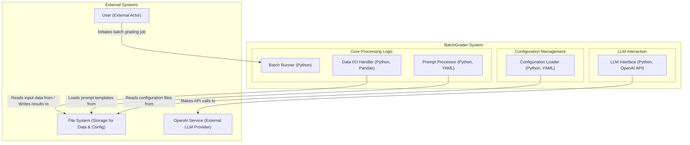
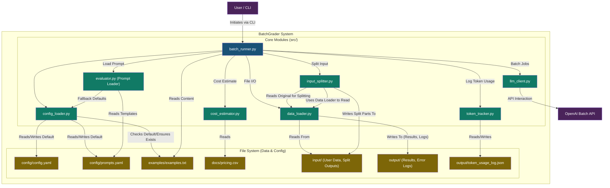
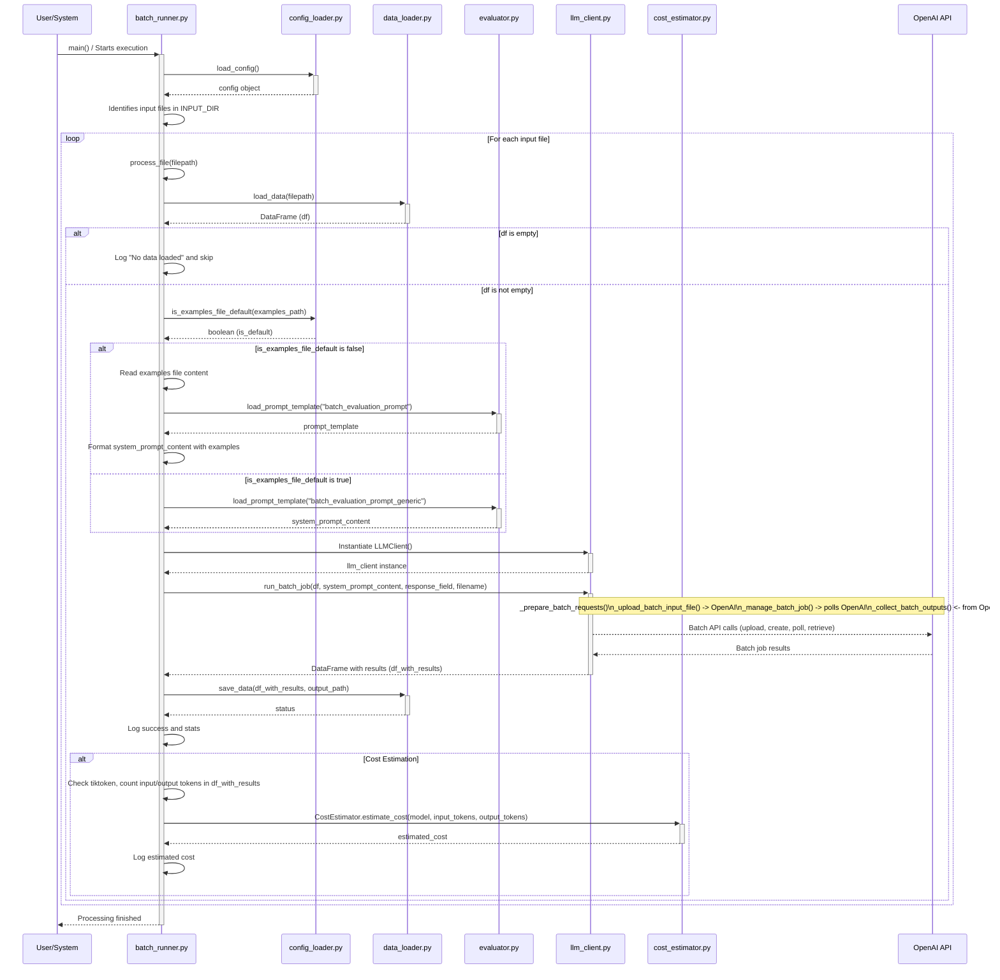

# **
<b>Execution Flow ((Sorry, I like graphs))</b>
**

```mermaid
graph TD

    subgraph 400["BatchGrader System"]
        subgraph 401["LLM Interaction"]
            416["LLM Interface (Python, OpenAI API)"]
        end
        subgraph 402["Core Processing Logic"]
            413["Batch Runner (Python)"]
            414["Prompt Processor (Python, YAML)"]
            415["Data I/O Handler (Python, Pandas)"]
        end
        subgraph 403["Configuration Management"]
            412["Configuration Loader (Python, YAML)"]
        end
    end
    subgraph 404["External Systems"]
        405["User (External Actor)"]
        406["File System (Storage for Data & Config)"]
        407["OpenAI Service (External LLM Provider)"]
    end
    %% Edges at this level (grouped by source)
    412["Configuration Loader (Python, YAML)"] -->|Reads configuration files from| 406["File System (Storage for Data & Config)"]
    405["User (External Actor)"] -->|Initiates batch grading job| 413["Batch Runner (Python)"]
    414["Prompt Processor (Python, YAML)"] -->|Loads prompt templates from| 406["File System (Storage for Data & Config)"]
    415["Data I/O Handler (Python, Pandas)"] -->|Reads input data from / Writes results to| 406["File System (Storage for Data & Config)"]
    416["LLM Interface (Python, OpenAI API)"] -->|Makes API calls to| 407["OpenAI Service (External LLM Provider)"]
```

```mermaid
graph TD
    %% Main System Group
    subgraph BatchGraderSystem["BatchGrader System"]
        direction LR
        %% Core Modules
        subgraph CoreModules["Core Modules (src/)"]
            BR["batch_runner.py"]
            CL["config_loader.py"]
            DL["data_loader.py"]
            E["evaluator.py (Prompt Loader)"]
            LC["llm_client.py"]
            CE["cost_estimator.py"]
            TT["token_tracker.py"]
            IS["input_splitter.py"]
        end

        %% Data & Config Files
        subgraph FileSystemData["File System (Data & Config)"]
            ConfigYAML["config/config.yaml"]
            PromptsYAML["config/prompts.yaml"]
            ExamplesTXT["examples/examples.txt"]
            PricingCSV["docs/pricing.csv"]
            InputDir["input/ (User Data, Split Outputs)"]
            OutputDir["output/ (Results, Error Logs)"]
            TokenLogJSON["output/token_usage_log.json"]
        end
    end

    %% External Elements
    User["User / CLI"]
    OpenAI_API["OpenAI Batch API"]

    %% Relationships
    User -- "Initiates via CLI" --> BR

    BR --> CL
    BR -- "File I/O" --> DL
    BR -- "Load Prompt" --> E
    BR -- "Batch Jobs" --> LC
    BR -- "Cost Estimate" --> CE
    BR -- "Log Token Usage" --> TT
    BR -- "Split Input" --> IS

    CL -- "Reads/Writes Default" --> ConfigYAML
    CL -- "Reads/Writes Default" --> PromptsYAML
    CL -- "Checks Default/Ensures Exists" --> ExamplesTXT

    E -- "Reads Templates" --> PromptsYAML
    E -- "Fallback Defaults" --> CL

    DL -- "Reads From" --> InputDir
    DL -- "Writes To (Results, Logs)" --> OutputDir

    LC -- "API Interaction" --> OpenAI_API
    %% LC uses tempfile, which interacts with FS, but not directly with DL for this
    %% For simplicity, direct DL link for temp file omitted, but LC does write a temp file.

    CE -- "Reads" --> PricingCSV
    TT -- "Reads/Writes" --> TokenLogJSON
    IS -- "Reads Original for Splitting" --> DL
    IS -- "Writes Split Parts To" --> InputDir


    BR -- "Reads Content" --> ExamplesTXT
    IS -- "Uses Data Loader to Read" --> DL

    %% Styling (optional, for clarity if rendered)
    style BR fill:#1A5276,color:#fff
    style User fill:#4A235A,color:#fff
    style OpenAI_API fill:#4A235A,color:#fff
    classDef module fill:#117A65,color:#fff
    classDef file fill:#7D6608,color:#fff
    class CL,DL,E,LC,CE,TT,IS module
    class ConfigYAML,PromptsYAML,ExamplesTXT,PricingCSV,InputDir,OutputDir,TokenLogJSON file
```

---

**
Architecture Diagram (Combined Structure & Execution)
**

```mermaid
flowchart TD
    User["User (CLI)"] ==> Main["batch_runner.py - main() / argparse"]

    subgraph ConfigHandling["Configuration Loading"]
        direction LR
        ConfigLoader["config_loader.py"]
        FS_Config["config.yaml"]
        FS_Prompts["prompts.yaml"]
        FS_Examples_Cfg["examples.txt (check)"]
        ConfigLoader --> FS_Config
        ConfigLoader --> FS_Prompts
        ConfigLoader --> FS_Examples_Cfg
    end

    Main -- "Load Config" --> ConfigLoader
    Main -- "Display Daily Usage" --> TokenTrackerUtil
    TokenTrackerUtil["token_tracker.py"] --> TokenLogFile["output/token_usage_log.json"]

    Main -- "For each/specified input file" --> FileLoop
    subgraph FileLoop["File Processing Loop (batch_runner.py)"]
        direction TB
        StartFile["Start File Process"]
        LoadData["data_loader.py - load_data()"]
        InputFile["input/[file]"]
        
        DeterminePrompt["Determine System Prompt"]
        Eval["evaluator.py - load_prompt_template()"]
        PromptsFile["config/prompts.yaml"]
        ExamplesContent["examples.txt (read content)"]
        
        TokenCounter["Define tiktoken counter"]

        StartFile --> LoadData --> InputFile
        StartFile --> DeterminePrompt
        DeterminePrompt --> ConfigLoaderSeq["config_loader.py - is_examples_file_default()"]
        DeterminePrompt --> Eval --> PromptsFile
        DeterminePrompt --> ExamplesContent
        StartFile --> TokenCounter

        subgraph CLI_Actions["CLI Action Handling"]
            direction LR
            IfCount["--count-tokens?"]
            IfSplit["--split-tokens?"]
            DefaultRun["Default Batch Run"]

            IfCount -- "Yes" --> CountTokens["Count & Print Stats"]
            IfSplit -- "Yes" --> SplitLogic["Split Logic"]
            IfCount -- "No" --> IfSplit
            IfSplit -- "No" --> DefaultRun
        end
        StartFile --> CLI_Actions
        
        subgraph SplittingProcess["Input Splitting (if active)"]
            InputSplitter["input_splitter.py"]
            SplitInputFile["input/[file_original]"]
            SplitOutputFile["input/[file_partN]"]
            SplitLogic --> InputSplitter
            InputSplitter -- "Uses counter" --> TokenCounter
            InputSplitter -- "Reads" --> SplitInputFile
            InputSplitter -- "Writes" --> SplitOutputFile
        end

        subgraph BatchJobProcess["Batch Job Processing (Default Run)"]
            direction TB
            LLM_Client["llm_client.py - run_batch_job()"]
            OpenAI_Service["OpenAI Batch API"]
            
            LLM_Client -- "Prepare, Upload, Manage, Process" --> OpenAI_Service
            
            LogTokenUsage["token_tracker.py - update_token_log()"]
            EstimateCost["cost_estimator.py - estimate_cost()"]
            PricingFile["docs/pricing.csv"]
            SaveOutput["data_loader.py - save_data()"]
            OutputFile["output/[file_results]"]

            DefaultRun --> LLM_Client
            DefaultRun --> LogTokenUsage
            DefaultRun --> EstimateCost --> PricingFile
            DefaultRun --> SaveOutput --> OutputFile
        end
    end

    %% Styling
    classDef main fill:#1A5276,color:#fff
    classDef module fill:#117A65,color:#fff
    classDef util fill:#B3B6B7,color:#000
    classDef file fill:#7D6608,color:#fff
    classDef ext fill:#4A235A,color:#fff
    classDef subgraph_bg fill:#2C3E50,stroke:#aaa,color:#fff
    
    class Main,ProcessFile,StartFile main
    class User,OpenAI_Service,OpenAI_API ext
    class ConfigLoader,DataLoader,Eval,LLMClient,LLM_Client,CostEstimator,TokenTracker,TokenTrackerUtil,InputSplitter,InputSplitterPy,ConfigLoaderSeq module
    class TokenCounterFunc,TokenCounter util
    class FS_Config,FS_Prompts,FS_Examples_Cfg,FS_Examples_Content,FS_Input,InputFile,FS_Output,OutputFile,FS_Pricing,PricingFile,FS_TokenLog,TokenLogFile,FS_SplitOutput,SplitInputFile,SplitOutputFile file
    class ConfigHandling,CoreProcessing,LLM,Utilities,FileLoop,CLI_Actions,SplittingProcess,BatchJobProcess subgraph_bg
```

---

**
Sequence Diagram (File Processing Flow)
**

```mermaid
sequenceDiagram
    participant User as User/System
    participant Runner as batch_runner.py
    participant ConfigL as config_loader.py
    participant DataL as data_loader.py
    participant Evaluator as evaluator.py
    participant LLMCli as llm_client.py
    participant CostEst as cost_estimator.py
    participant OpenAI as OpenAI API

    User->>+Runner: main() / Starts execution
    Runner->>+ConfigL: load_config()
    ConfigL-->>-Runner: config object
    Runner->>Runner: Identifies input files in INPUT_DIR
    loop For each input file
        Runner->>Runner: process_file(filepath)
        Runner->>+DataL: load_data(filepath)
        DataL-->>-Runner: DataFrame (df)
        alt df is empty
            Runner->>Runner: Log "No data loaded" and skip
        else df is not empty
            Runner->>ConfigL: is_examples_file_default(examples_path)
            ConfigL-->>Runner: boolean (is_default)
            alt is_examples_file_default is false
                Runner->>Runner: Read examples file content
                Runner->>+Evaluator: load_prompt_template("batch_evaluation_prompt")
                Evaluator-->>-Runner: prompt_template
                Runner->>Runner: Format system_prompt_content with examples
            else is_examples_file_default is true
                Runner->>+Evaluator: load_prompt_template("batch_evaluation_prompt_generic")
                Evaluator-->>-Runner: system_prompt_content
            end

            Runner->>+LLMCli: Instantiate LLMClient()
            LLMCli-->>-Runner: llm_client instance
            Runner->>+LLMCli: run_batch_job(df, system_prompt_content, response_field, filename)
            Note over LLMCli,OpenAI: _prepare_batch_requests()\n_upload_batch_input_file() -> OpenAI\n_manage_batch_job() -> polls OpenAI\n_collect_batch_outputs() <- from OpenAI
            LLMCli-->>OpenAI: Batch API calls (upload, create, poll, retrieve)
            OpenAI-->>LLMCli: Batch job results
            LLMCli-->>-Runner: DataFrame with results (df_with_results)

            Runner->>+DataL: save_data(df_with_results, output_path)
            DataL-->>-Runner: status
            Runner->>Runner: Log success and stats

            alt Cost Estimation
                Runner->>Runner: Check tiktoken, count input/output tokens in df_with_results
                Runner->>+CostEst: CostEstimator.estimate_cost(model, input_tokens, output_tokens)
                CostEst-->>-Runner: estimated_cost
                Runner->>Runner: Log estimated cost
            end
        end
    end
    Runner-->>-User: Processing finished
```
