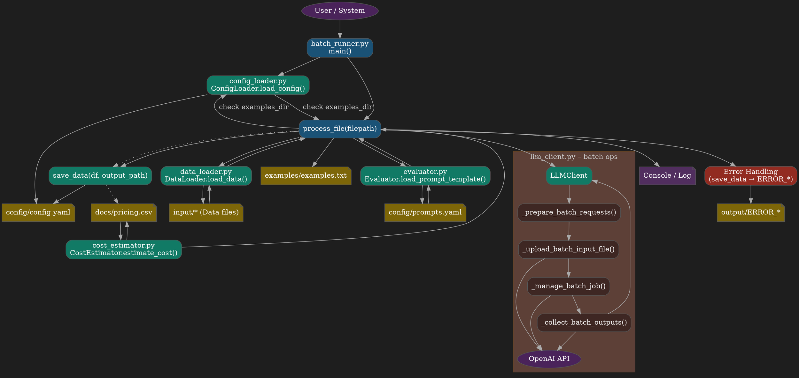

# Architecture Diagrams

## 1. Execution Flow ((Sorry, I like graphs))

This diagram provides an overview of the main components and their primary interactions, aligning component names with your Python files and detailing data sources.

```graphviz
digraph ExecutionFlow {
    // Dark background settings
    bgcolor="#1E1E1E";
    node [style="filled,rounded", fontcolor="white", color="#555555"];
    edge [color="#AAAAAA", fontcolor="#CCCCCC"];

    // User initiates the process
    User [label="User (External Actor)", shape=ellipse, fillcolor="#4A235A"]; 
    Main [label="batch_runner.py\n(Main Process)", fillcolor="#1A5276"];
    
    // Core components
    ConfigLoader [label="config_loader.py", fillcolor="#117A65"];
    DataLoader [label="data_loader.py", fillcolor="#117A65"];
    Evaluator [label="evaluator.py\n(Prompt Handling)", fillcolor="#117A65"];
    LLMClient [label="llm_client.py\n(OpenAI Interaction)", fillcolor="#117A65"];
    CostEstimator [label="cost_estimator.py", fillcolor="#117A65"];
    
    // File resources
    ReadsConfig [label="config/config.yaml", shape=note, fillcolor="#7D6608"];
    ReadsPromptsYAML [label="config/prompts.yaml", shape=note, fillcolor="#7D6608"];
    ReadsExamples [label="examples/examples.txt", shape=note, fillcolor="#7D6608"];
    ReadsPricing [label="docs/pricing.csv", shape=note, fillcolor="#7D6608"];
    ReadsInput [label="Input Data\n(input/)", shape=folder, fillcolor="#7D6608"];
    WritesOutput [label="Output Data\n(output/)", shape=folder, fillcolor="#7D6608"];
    
    // External systems
    OpenAI [label="OpenAI Batch API\n(External Service)", shape=ellipse, fillcolor="#4A235A"];
    FileSystem [label="File System", shape=ellipse, fillcolor="#4A235A"];
    
    // Core group
    subgraph cluster_BatchGraderSystem {
        label="BatchGrader System";
        fontcolor="#CCCCCC";
        color="#555555";
        
        // Core logic group
        subgraph cluster_CoreLogic {
            label="Core Processing Logic";
            fontcolor="#CCCCCC";
            color="#555555";
            ConfigLoader; DataLoader; Evaluator; LLMClient; CostEstimator;
        }
        
        // Configuration & data sources
        subgraph cluster_ConfigDataSources {
            label="Configuration & Data Management";
            fontcolor="#CCCCCC";
            color="#555555";
            ReadsConfig; ReadsPromptsYAML; ReadsExamples; ReadsPricing; ReadsInput; WritesOutput;
        }
    }
    
    // External systems group
    subgraph cluster_ExternalSystems {
        label="External Systems & Storage";
        fontcolor="#CCCCCC";
        color="#555555";
        OpenAI; FileSystem;
    }
    
    // Direct Connections
    User -> Main;
    Main -> ConfigLoader;
    Main -> DataLoader;
    Main -> Evaluator;
    Main -> LLMClient;
    Main -> CostEstimator;
    
    ConfigLoader -> ReadsConfig;
    ConfigLoader -> ReadsPromptsYAML;
    Evaluator -> ReadsPromptsYAML;
    Main -> ReadsExamples;
    CostEstimator -> ReadsPricing;
    DataLoader -> ReadsInput;
    DataLoader -> WritesOutput;
    
    LLMClient -> OpenAI;
    
    // File system connections (using dashed lines)
    FileSystem -> ReadsConfig [style=dashed];
    FileSystem -> ReadsPromptsYAML [style=dashed];
    FileSystem -> ReadsExamples [style=dashed];
    FileSystem -> ReadsPricing [style=dashed];
    FileSystem -> ReadsInput [style=dashed];
    FileSystem -> WritesOutput [style=dashed];
    
    // Dotted connections for high-level interactions
    User -> Main [style=dotted, label="Triggers execution"];
    Main -> cluster_CoreLogic [style=dotted, label="Orchestrates"];
    cluster_CoreLogic -> cluster_ConfigDataSources [style=dotted, label="Interacts with"];
    LLMClient -> OpenAI [style=dotted, label="Communicates with"];
    DataLoader -> FileSystem [style=dotted, label="Reads/Writes to/from"];
    ConfigLoader -> FileSystem [style=dotted, label="Reads from"];
    Evaluator -> FileSystem [style=dotted, label="Reads from"];
    CostEstimator -> FileSystem [style=dotted, label="Reads from"];
}
```



## 2. Module Interactions & File Access

This diagram focuses on the direct interactions between the core Python modules and the configuration/data files they access.

```graphviz
digraph ModuleInteractions {
    // Dark background settings
    bgcolor="#1E1E1E";
    node [style="filled,rounded", fontcolor="white", color="#555555"];
    edge [color="#AAAAAA", fontcolor="#CCCCCC"];

    // External actor
    User [label="User (External Actor)", shape=ellipse, fillcolor="#4A235A"];
    
    // Core components
    BR [label="batch_runner.py", fillcolor="#117A65"];
    CL [label="config_loader.py", fillcolor="#117A65"];
    DL [label="data_loader.py", fillcolor="#117A65"];
    E [label="evaluator.py", fillcolor="#117A65"];
    LC [label="llm_client.py", fillcolor="#117A65"];
    CE [label="cost_estimator.py", fillcolor="#117A65"];
    
    // File resources
    CfgYAML [label="config/config.yaml", shape=note, fillcolor="#7D6608"];
    PrmYAML [label="config/prompts.yaml", shape=note, fillcolor="#7D6608"];
    ExTXT [label="examples/examples.txt", shape=note, fillcolor="#7D6608"];
    PrcCSV [label="docs/pricing.csv", shape=note, fillcolor="#7D6608"];
    InputDir [label="input/ (User Data)", shape=folder, fillcolor="#7D6608"];
    OutputDir [label="output/ (Results)", shape=folder, fillcolor="#7D6608"];
    
    // External systems
    OpenAI_API [label="OpenAI Batch API", shape=ellipse, fillcolor="#4A235A"];
    FileSystem [label="File System", shape=ellipse, fillcolor="#4A235A"];
    
    // Core system group
    subgraph cluster_BatchGraderSystem {
        label="BatchGrader System";
        fontcolor="#CCCCCC";
        color="#555555";
        
        // Core components
        BR; CL; DL; E; LC; CE;
        
        // Configuration & files
        CfgYAML; PrmYAML; ExTXT; PrcCSV; InputDir; OutputDir;
    }
    
    // External services group
    subgraph cluster_ExternalServices {
        label="External Services & System Interfaces";
        fontcolor="#CCCCCC";
        color="#555555";
        OpenAI_API; FileSystem;
    }
    
    // Connections with labeled edges
    User -> BR [label="Initiates Process"];
    
    BR -> CL [label="Loads Config"];
    BR -> DL [label="Loads/Saves Data"];
    BR -> E [label="Handles Prompts"];
    BR -> LC [label="Interacts with LLM"];
    BR -> CE [label="Estimates Cost"];
    
    CL -> CfgYAML [label="Reads"];
    CL -> PrmYAML [label="Reads"];
    E -> PrmYAML [label="Reads Prompt Templates"];
    BR -> ExTXT [label="Reads Examples Content"];
    CL -> ExTXT [label="Checks if Default"];
    CE -> PrcCSV [label="Reads Pricing Data"];
    DL -> InputDir [label="Reads from"];
    DL -> OutputDir [label="Writes to"];
    
    LC -> OpenAI_API [label="Sends Batch Job, Polls,\nRetrieves Results"];
    
    // File System connections (using dashed lines)
    FileSystem -> CfgYAML [style=dashed];
    FileSystem -> PrmYAML [style=dashed];
    FileSystem -> ExTXT [style=dashed];
    FileSystem -> PrcCSV [style=dashed];
    FileSystem -> InputDir [style=dashed];
    FileSystem -> OutputDir [style=dashed];
}
```



---

## 3. Architecture Diagram (Combined Structure & Execution)

This flowchart offers a more granular view of the execution flow, particularly within the process_file function of batch_runner.py and the internal operations of llm_client.py.



---

## 4. Sequence Diagram (File Processing Flow)

This sequence diagram provides an "insane" level of detail, especially for the interactions within llm_client.py and its communications with the OpenAI API and FileSystem.

```graphviz
digraph ProcessSequence {
    // Dark background and styling
    bgcolor="#1E1E1E";
    node [style="filled,rounded", fontcolor="white", color="#555555"];
    edge [color="#AAAAAA", fontcolor="#CCCCCC"];
    
    // Ranking to maintain sequence diagram flow (top to bottom)
    rankdir=TB;
    
    // Define nodes for participants with different colors
    User [label="User", shape=circle, fillcolor="#4A235A"];
    Runner [label="batch_runner.py", fillcolor="#1A5276"];
    ConfigL [label="config_loader.py", fillcolor="#117A65"];
    DataL [label="data_loader.py", fillcolor="#117A65"];
    Evaluator [label="evaluator.py", fillcolor="#117A65"];
    LLMCli [label="llm_client.py", fillcolor="#117A65"];
    CostEst [label="cost_estimator.py", fillcolor="#117A65"];
    OpenAI [label="OpenAI API", shape=ellipse, fillcolor="#4A235A"];
    FileSystem [label="FileSystem", shape=cylinder, fillcolor="#4A235A"];
    
    // Initial sequence
    Init1 [label="main()", shape=plaintext, fillcolor="transparent"];
    Init2 [label="load_config()", shape=plaintext, fillcolor="transparent"];
    Init3 [label="config", shape=plaintext, fillcolor="transparent"];
    Init4 [label="List files in INPUT_DIR", shape=plaintext, fillcolor="transparent"];
    
    // Main processing subgraph for clarity
    subgraph cluster_main_process {
        label="File Processing Flow";
        fontcolor="#CCCCCC";
        color="#555555";
        style="filled";
        fillcolor="#0E191A";
        
        // Process file activities
        Process1 [label="process_file\n(input_file_path)", fillcolor="#1A5276"];
        LoadData [label="load_data\n(input_file_path)", fillcolor="#117A65"];
        GetExamples [label="is_examples_file_default\n(examples_path)", fillcolor="#117A65"];
        ReadExamples [label="Read examples.txt", fillcolor="#7D6608"];
        LoadPromptTemplate [label="load_prompt_template\n(template_name)", fillcolor="#117A65"];
        FormatPrompt [label="format prompt\nwith examples", fillcolor="#1A5276"];
        
        // LLM client operations
        CreateLLMClient [label="new LLMClient()", fillcolor="#117A65"];
        RunBatchJob [label="run_batch_job\n(df, system_prompt)", fillcolor="#117A65"];
        PrepareRequests [label="_prepare_batch_requests", fillcolor="#3E2723"];
        UploadFile [label="_upload_batch_input_file", fillcolor="#3E2723"];
        ManageJob [label="_manage_batch_job", fillcolor="#3E2723"];
        CollectOutputs [label="_process_batch_outputs", fillcolor="#3E2723"];
        
        // Final operations
        SaveResults [label="save_data\n(df_with_results)", fillcolor="#117A65"];
        EstimateCost [label="estimate_cost\n(model, tokens)", fillcolor="#117A65"];
        LogCost [label="Log estimated cost", fillcolor="#1A5276"];
        ErrorHandling [label="Error Handling", fillcolor="#922B21"];
        SaveError [label="save_data\n(error_df)", fillcolor="#922B21"];
    }
    
    // External resources
    APIFiles [label="files.create\nfiles.content", fillcolor="#4A235A"];
    APIBatches [label="batches.create\nbatches.retrieve", fillcolor="#4A235A"];
    InputFile [label="input/* files", shape=note, fillcolor="#7D6608"];
    ExamplesFile [label="examples/examples.txt", shape=note, fillcolor="#7D6608"];
    PromptsFile [label="config/prompts.yaml", shape=note, fillcolor="#7D6608"];
    OutputFile [label="output/* files", shape=note, fillcolor="#7D6608"];
    PricingFile [label="docs/pricing.csv", shape=note, fillcolor="#7D6608"];
    ErrorFile [label="output/ERROR_*", shape=note, fillcolor="#7D6608"];
    
    // Main flow connections
    User -> Init1 -> Runner;
    Runner -> Init2 -> ConfigL;
    ConfigL -> Init3 -> Runner;
    Runner -> Init4 -> FileSystem;
    
    // Process file flow
    Runner -> Process1 -> LoadData -> DataL;
    DataL -> InputFile [dir=both, label="Read/Parse"];
    DataL -> Runner [label="df (DataFrame)"];
    
    // Empty check branch
    Process1 -> GetExamples -> ConfigL [label="if df not empty"];
    ConfigL -> ExamplesFile [dir=both, label="Check"];
    ConfigL -> Runner [label="is_default"];
    
    // Examples & Prompt flow
    Runner -> ReadExamples -> ExamplesFile [label="if is_default false"];
    Runner -> LoadPromptTemplate -> Evaluator;
    Evaluator -> PromptsFile [dir=both, label="Read"];
    Evaluator -> Runner [label="prompt_template"];
    Runner -> FormatPrompt [label="format template"];
    
    // LLM operations flow
    Runner -> CreateLLMClient -> LLMCli;
    LLMCli -> Runner [label="client instance"];
    Runner -> RunBatchJob -> LLMCli;
    LLMCli -> PrepareRequests [label="prepare"];
    PrepareRequests -> UploadFile [label="upload"];
    UploadFile -> FileSystem [label="Write temp .jsonl"];
    UploadFile -> APIFiles -> OpenAI [label="upload"];
    OpenAI -> LLMCli [label="input_file_id"];
    UploadFile -> ManageJob [label="manage"];
    ManageJob -> APIBatches -> OpenAI [label="create & poll"];
    OpenAI -> LLMCli [label="batch status"];
    ManageJob -> CollectOutputs [label="process"];
    CollectOutputs -> OpenAI [label="retrieve results"];
    OpenAI -> LLMCli [label="output/error files"];
    CollectOutputs -> LLMCli [label="results"];
    LLMCli -> Runner [label="df_with_results"];
    
    // Save results & Cost estimation
    Runner -> SaveResults -> DataL;
    DataL -> OutputFile [label="Write"];
    DataL -> Runner [label="save status"];
    Runner -> EstimateCost -> CostEst [label="if tiktoken available"];
    CostEst -> PricingFile [dir=both, label="Read"];
    CostEst -> Runner [label="cost estimate"];
    Runner -> LogCost [label="log"];
    
    // Error handling path
    Process1 -> ErrorHandling [style=dashed, label="On Exception"];
    ErrorHandling -> SaveError -> DataL;
    DataL -> ErrorFile [label="Write"];
    DataL -> Runner [label="error status"];
    Runner -> User [label="Processing Finished"];
    
    // Visual organization - group related nodes
    {rank=same; User Init1}
    {rank=same; Runner Init2}
    {rank=same; ConfigL Init3}
    {rank=same; FileSystem Init4}
    {rank=same; Process1 LoadData}
    {rank=same; DataL InputFile}
    {rank=same; GetExamples ConfigL}
    {rank=same; LoadPromptTemplate Evaluator PromptsFile}
    {rank=same; RunBatchJob LLMCli}
    {rank=same; APIFiles OpenAI APIBatches}
    {rank=same; SaveResults DataL OutputFile}
    {rank=same; EstimateCost CostEst PricingFile}
    {rank=same; ErrorHandling SaveError ErrorFile}
}
