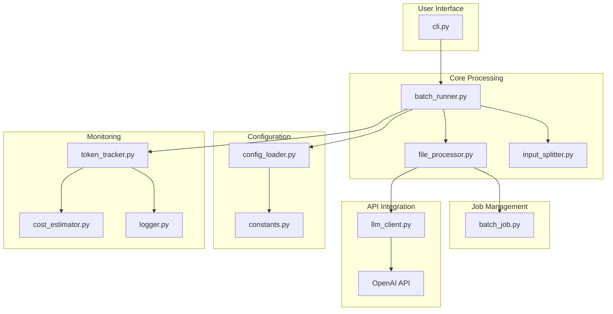
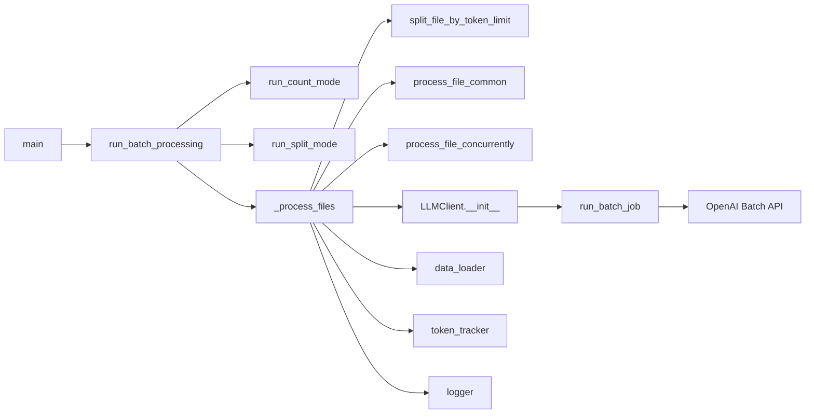

# BatchGrader: Comprehensive Code Review & Action Plan

## I. System Overview

BatchGrader is a sophisticated Python-based system for batch processing text evaluations using OpenAI's Batch API. It offers three primary operational modes:

1. **Batch Processing**: Submit and monitor large-scale evaluations with configurable chunking
2. **Token Management**: Accurate token counting and cost estimation
3. **File Operations**: Intelligent file splitting and processing

### Architectural Highlights

- **Modular Design**: Clear separation of concerns with dedicated components for each responsibility
- **Extensible Architecture**: Well-defined interfaces allow for future expansion
- **Comprehensive Logging**: Detailed logging for debugging and monitoring
- **Configuration Management**: Flexible configuration through YAML and environment variables

**Major Subsystems:**

- **CLI & Orchestration**: `src/cli.py`, `src/batch_runner.py`
- **File Processing**: `src/file_processor.py`, `src/batch_job.py`
- **Input Splitting**: `src/input_splitter.py`
- **LLM API Integration**: `src/llm_client.py`
- **Token Management**: `src/token_utils.py`, `src/token_tracker.py`, `src/cost_estimator.py`
- **Configuration**: `src/config_loader.py`, `src/constants.py`
- **Prompt Management**: `src/prompt_utils.py`, `src/evaluator.py`
- **Logging & Monitoring**: `src/logger.py`, `src/rich_display.py`, `src/log_utils.py`
- **Utilities**: `src/utils.py`, `src/exceptions.py`, `src/file_utils.py`, `src/data_loader.py`

**External Dependencies:**  
`openai`, `pandas`, `tiktoken`, `rich`, `pyyaml`, `python-dotenv`, `pytest` (testing)

---

## II. Architectural Patterns

### Core Design Patterns

- **Command Pattern**: Implemented in the CLI for different operation modes (`batch`, `count`, `split`)
- **Factory Method**: Used for creating encoders and token counters
- **Strategy Pattern**: Different strategies for processing files (sequential or concurrent)
- **Dependency Injection**: Components are passed as parameters rather than instantiated internally
- **Observer Pattern**: Token tracking and logging observe system operations
- **Repository Pattern**: Abstract data access for different file formats
- **Facade Pattern**: `llm_client.py` and `batch_runner.py` simplify complex operations

### Communication Models

- **File-Based Communication**: Input and output primarily through files
- **REST API**: For communication with OpenAI's batch endpoints
- **Synchronous Request-Response**: For LLM API interactions
- **Event Logging**: For tracking system events and token usage

### Data Flow Paradigms

- **ETL Pipeline**: Extract (load files), Transform (process through LLM), Load (save results)
- **Stream Processing**: For handling large files in chunks
- **Batch Processing**: Primary paradigm for processing multiple inputs at once

### State Management

- **Stateless Core Processing**: State is externalized (files, logs)
- **Job/Chunk Objects**: Explicit job status, error, and result tracking
- **No Persistent In-Memory State**: Across CLI invocations

---

## III. Critical Findings

### 1. Token Management (High Priority)

- **Inconsistent Token Counting**: Current implementation may produce different token counts than the OpenAI API
- **Performance Impact**: Token counting can be slow for large files
- **Cost Estimation**: Current cost projections may be inaccurate due to token counting discrepancies

### 2. API Integration & Abstraction (High Priority)

- **Tight Coupling**: Direct dependency on OpenAI's API limits flexibility
- **Error Handling**: Limited handling of API rate limits and transient failures
- **Retry Logic**: Basic retry mechanism that may not handle all failure scenarios

### 3. File Processing & Chunking (Medium Priority)

- **Complex File Splitting**: Current implementation in `input_splitter.py` is complex and may be hard to maintain
- **I/O Operations**: File operations are not optimized for large datasets
- **Memory Usage**: Potential memory issues with very large files

### 4. Error Handling & Recovery (High Priority)

- **Silent Failures**: Some exceptions are caught and logged without proper handling
- **Error Recovery**: Limited recovery mechanisms for failed operations
- **Error Reporting**: Error messages could be more informative for debugging

### 5. Security Considerations (Medium Priority)

- **API Key Management**: API keys are passed in configuration
- **Input Validation**: Limited validation of input data
- **Error Message Leakage**: Potential information disclosure in error messages

---

## IV. Technical Diagrams

### 1. High-Level System Flow



### 2. Processing Pipeline



---

## V. Key Recommendations

### 1. Token Management Improvements

- **Align Token Counting**: Ensure token counting matches OpenAI's implementation exactly
- **Add Caching**: Implement caching for token counting results to improve performance
- **Enhance Cost Estimation**: Update cost estimation to reflect actual API usage more accurately
- **Support Custom Tokenizers**: Allow for custom tokenizers to support different models

### 2. API Abstraction Layer (High Priority)

```python
class LLMProvider(ABC):
    """Abstract base class for LLM providers."""
    
    @abstractmethod
    async def process_batch(self, batch_data: List[Dict]) -> List[Dict]:
        """Process a batch of data using the LLM."""
        pass

class OpenAIBatchProvider(LLMProvider):
    """Implementation for OpenAI's Batch API."""
    
    def __init__(self, config: Dict):
        self.client = OpenAIClient(api_key=config['api_key'])
        self.config = config
    
    async def process_batch(self, batch_data: List[Dict]) -> List[Dict]:
        """Process batch using OpenAI's Batch API with proper error handling."""
        try:
            return await self._call_openai_api(batch_data)
        except Exception as e:
            self._handle_api_error(e)
            raise
```

### 3. Enhanced Error Handling & Recovery

- **Comprehensive Error Handling**: Implement proper error handling for all external calls
- **Detailed Logging**: Add structured logging for better debugging
- **Circuit Breaker Pattern**: Implement circuit breaker for API calls to prevent cascading failures
- **Exponential Backoff**: Add retry logic with exponential backoff for transient failures

### 4. Performance Optimizations

- **Async I/O**: Implement asynchronous I/O operations for better performance
- **Streaming Processing**: Add support for streaming processing of large files
- **Batch Processing**: Optimize batch processing for better resource utilization
- **Memory Management**: Implement better memory management for large datasets

### 5. Security Enhancements

- **Credential Management**: Implement secure credential handling
- **Input Validation**: Add comprehensive input validation
- **Error Sanitization**: Sanitize error messages to prevent information leakage
- **Rate Limiting**: Add rate limiting to prevent API abuse

## VI. Implementation Roadmap

### Phase 1: Critical Fixes (1-2 weeks)

- Fix token counting implementation
- Implement secure credential handling
- Add comprehensive input validation
- Improve error handling and logging

### Phase 2: Architecture Improvements (2-3 weeks)

- Implement LLM provider abstraction
- Add async I/O support
- Refactor configuration management
- Optimize file handling and chunking

### Phase 3: Enhanced Features (2-3 weeks)

- Add support for additional LLM providers
- Implement advanced monitoring and metrics
- Add support for custom tokenizers
- Improve documentation and examples

## VII. Key Action Items

### 1. **Refactor Token Counting for Splitting**

- **Problem:** `_count_row_tokens` in `file_processor.py` uses a simplified approach, which may not match the actual prompt logic.
- **Action:** Refactor to use `create_token_counter` from `token_utils.py` to ensure token counting for splitting matches API requests.
- **Rationale:** Prevents oversized chunks and ensures compliance with API token limits.

### 2. **Strengthen API Abstraction**

- **Problem:** Tight coupling to OpenAI’s API makes adaptation difficult.
- **Action:** Implement an abstraction/interface layer for LLM API operations. Decouple batch logic from API client logic.
- **Rationale:** Eases future migration to other providers and supports future API changes.

### 3. **Improve Configuration Error Handling**

- **Problem:** Errors in config loading are not granular; deep merging is hard to debug.
- **Action:** Add granular error handling and validation in `config_loader.py`. Improve logging for config merges and failures.
- **Rationale:** Makes configuration issues easier to diagnose and fix.

### 4. **Enhance File Splitting Logic**

- **Problem:** Recursive splitting in `input_splitter.py` is complex and may be hard to debug.
- **Action:** Add more robust logging, simplify recursion, and document `_original_ext` and chunking logic.
- **Rationale:** Improves maintainability and debuggability.

### 5. **Concurrency and Performance**

- **Problem:** Thread pool sizing is not configurable; no async I/O.
- **Action:** Expose thread pool size as a config option. Evaluate feasibility of async I/O for file and API operations.
- **Rationale:** Allows tuning for different workloads and hardware.

### 6. **Security Improvements**

- **Problem:** API keys in config, file system operations need validation, error messages may leak info.
- **Action:** Mask API keys in logs, validate all file paths and operations, sanitize error output.
- **Rationale:** Reduces risk of credential leakage and file system vulnerabilities.

### 7. **Test Coverage and Exception Handling**

- **Problem:** Some custom exceptions are unused; not all error paths are covered.
- **Action:** Ensure all exceptions are used or removed. Expand tests to cover all error and edge cases, especially for custom exceptions.
- **Rationale:** Improves reliability and code clarity.

### 8. **Documentation**

- **Problem:** Some internal parameters and flows are under-documented.
- **Action:** Expand docstrings, especially for internal-use parameters like `_original_ext`. Update architecture diagrams and README to reflect current design.
- **Rationale:** Lowers onboarding friction and improves maintainability.

---

## VIII. Architectural Concerns & Bottlenecks

### 1. Coupling & Cohesion

- **Tight Coupling**: High coupling between `batch_runner.py` and `llm_client.py`
- **Mixed Concerns**: `batch_runner.py` handles both orchestration and business logic
- **Global State**: Token tracking uses global state which complicates testing and maintenance

### 2. Performance Considerations

- **Token Counting**: Can be slow for large files
- **File I/O**: Synchronous file operations may block the event loop
- **Memory Usage**: Large files may consume significant memory

### 3. Extensibility

- **Vendor Lock-in**: Tight coupling to OpenAI's API
- **Configuration Complexity**: Deep configuration hierarchies can be hard to manage
- **Plugin System**: No clear extension points for custom functionality

### 4. Observability

- **Limited Metrics**: Basic metrics collection
- **Debugging Challenges**: Complex error scenarios may be hard to diagnose
- **Logging**: Could benefit from structured logging

### 5. Security

- **API Key Management**: Basic API key handling
- **Input Validation**: Limited validation of input data
- **Error Handling**: Potential information leakage in error messages

---

## IX. Summary Table: Action Items

| Area                        | Issue/Opportunity                        | Action                                                        | Priority |
|-----------------------------|------------------------------------------|---------------------------------------------------------------|----------|
| Token Counting              | Inconsistent with OpenAI                 | Align token counting with OpenAI's implementation            | High     |
| API Abstraction             | Tight coupling to OpenAI                 | Introduce provider interface                                  | High     |
| Error Handling              | Limited recovery mechanisms              | Implement circuit breaker, retry logic                       | High     |
| Security                    | API key management, input validation     | Secure credential handling, input validation                 | High     |
| Performance                 | Synchronous I/O, memory usage            | Implement async I/O, streaming, better memory management     | Medium   |
| Configuration               | Complex deep merging                     | Simplify configuration hierarchy, improve validation         | Medium   |
| Documentation               | Gaps in API and architecture docs        | Expand architecture documentation, API references             | Medium   |
| Testing                     | Limited error scenario coverage          | Add tests for error cases, edge cases                        | Medium   |
| Monitoring & Observability  | Basic logging, limited metrics           | Add structured logging, metrics collection                   | Low      |
| Extensibility               | No clear extension points                | Define plugin system, extension points                       | Low      |

---

## X. Component-Specific Findings

### 1. Token Management (High Priority)

- **Inconsistent Token Counting**: Current implementation may produce different token counts than the OpenAI API
- **Performance Impact**: Token counting can be slow for large files
- **Cost Estimation**: Current cost projections may be inaccurate due to token counting discrepancies

### 2. API Integration & Abstraction (High Priority)

- **Tight Coupling**: Direct dependency on OpenAI's API limits flexibility
- **Error Handling**: Limited handling of API rate limits and transient failures
- **Retry Logic**: Basic retry mechanism that may not handle all failure scenarios

### 3. File Processing & Chunking (Medium Priority)

- **Complex File Splitting**: Current implementation in `input_splitter.py` is complex and may be hard to maintain
- **I/O Operations**: File operations are not optimized for large datasets
- **Memory Usage**: Potential memory issues with very large files

### 4. Error Handling & Recovery (High Priority)

- **Silent Failures**: Some exceptions are caught and logged without proper handling
- **Error Recovery**: Limited recovery mechanisms for failed operations
- **Error Reporting**: Error messages could be more informative for debugging

### 5. Security Considerations (Medium Priority)

- **API Key Management**: API keys are passed in configuration
- **Input Validation**: Limited validation of input data
- **Error Message Leakage**: Potential information disclosure in error messages

---

## XI. Test Strategy

- Increase test coverage for error cases
- Add integration tests for end-to-end workflows
- Implement performance benchmarks
- Add security testing

---

## XII. Conclusion

The BatchGrader system demonstrates a solid foundation with clear architectural boundaries. By addressing the critical findings and implementing the recommended improvements, the system will become more robust, maintainable, and extensible. The proposed changes focus on improving token management, API abstraction, error handling, and performance while maintaining backward compatibility.

For the most up-to-date architecture diagrams, please refer to the [Architecture Diagrams](./architecture_diagrams/council_review_5_16.md) document.

The BatchGrader system is well-architected but would benefit from the recommended improvements to token handling, API abstraction, and performance optimizations. The proposed changes will make the system more robust, maintainable, and extensible while improving the developer and user experience.

For the most up-to-date architecture diagrams, please refer to the [Architecture Diagrams](./council_review/architecture_diagrams/council_review_5_16.md) document.
