# BatchGrader Architecture Diagrams

## 1. High-Level System Architecture

### 1.1 Core System Architecture

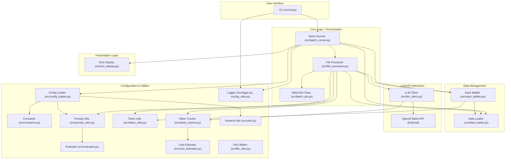

### 1.3 Component Relationships (Claude's Version)

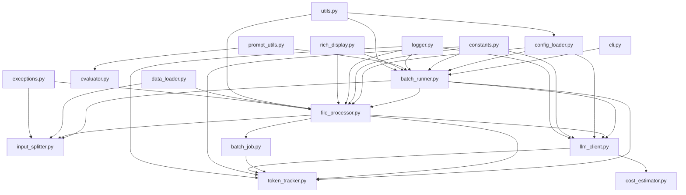

## 2. Data Flow & Processing

### 2.1 Data Flow Diagram

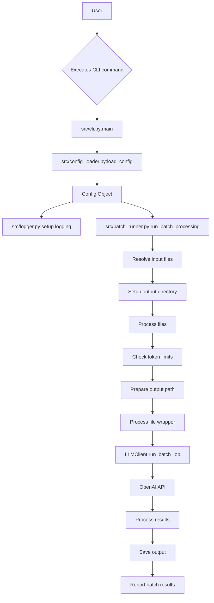

### 2.2 Data Flow with Batch Processing (Claude's Version)

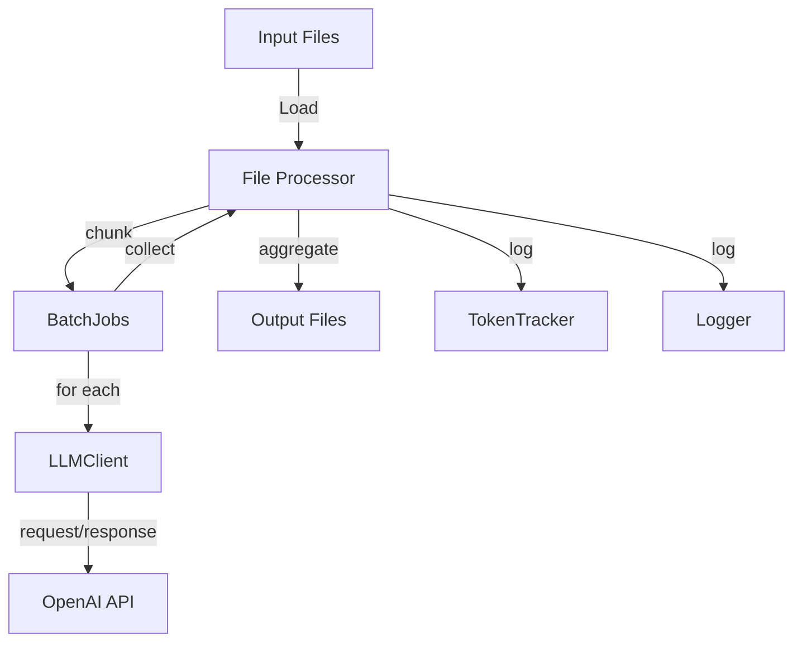


## 3. Component Relationships & State Management

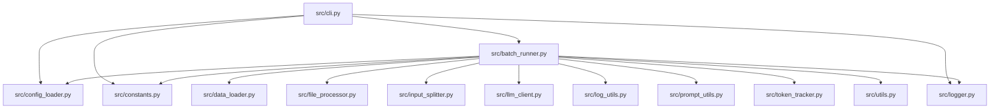

### 3.1 BatchJob State Transitions

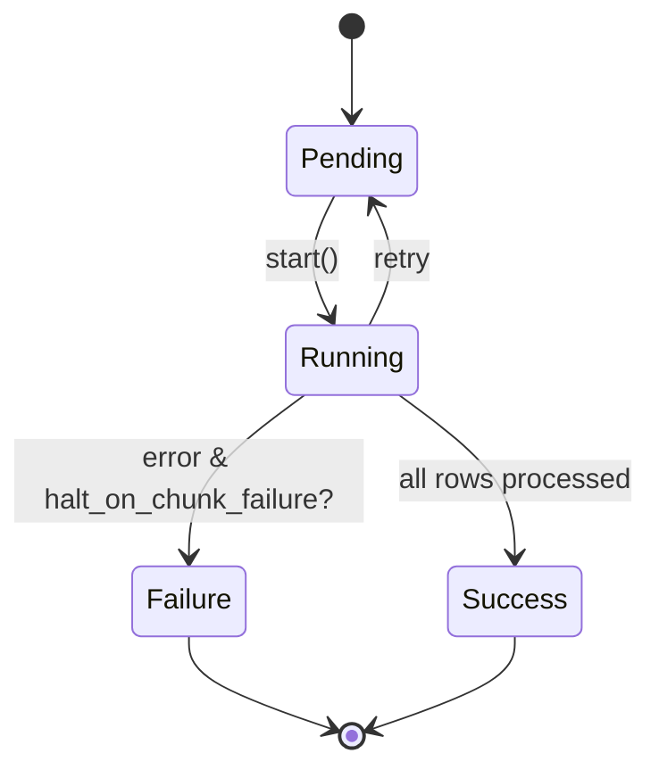

## 4. Execution Paths

### 4.1 Concurrent Processing Flow

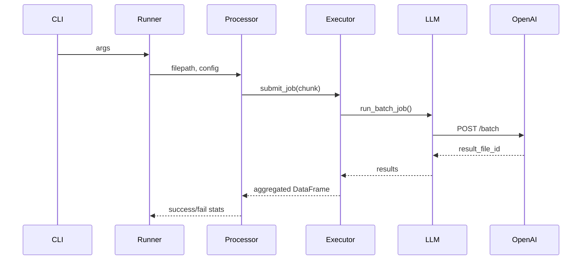

### 4.2 Execution Path Overview

- **CLI** → **Config Load** → **Mode Dispatch** → **File Discovery** → **File Processing** → **LLM API** → **Result Aggregation** → **Output/Log/Cost**

#### Error/Recovery Paths

- Token limit exceeded → abort or skip (configurable)
- API/network error → per-chunk fail, aggregate with error message
- File IO error → skip file, halt batch (configurable)
- All errors logged with configurable recovery options

## 5. Token Management & Processing

### 5.1 Token Counting and Chunking Flow

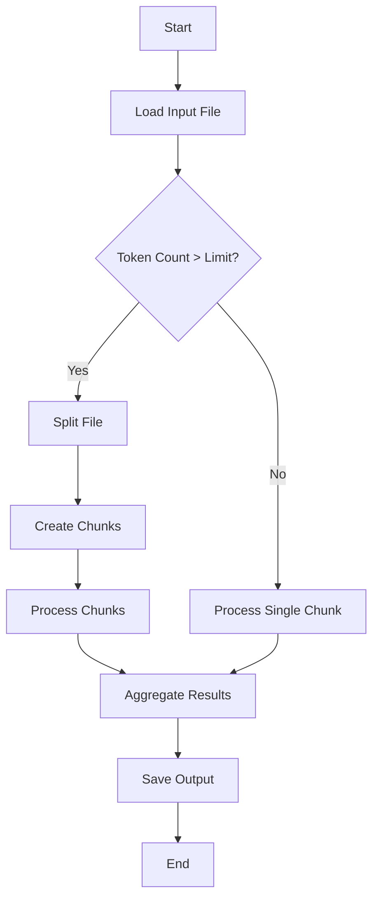

### 5.2 Token Management System

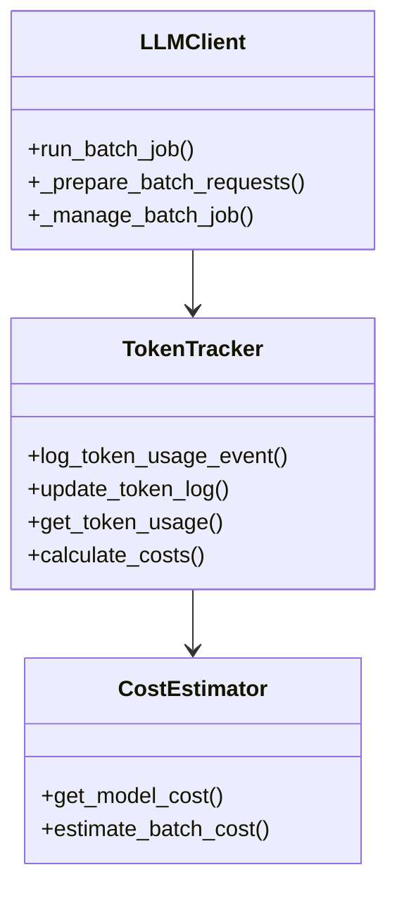

## 6. Error Handling & Recovery

### 6.1 Error Handling Flow

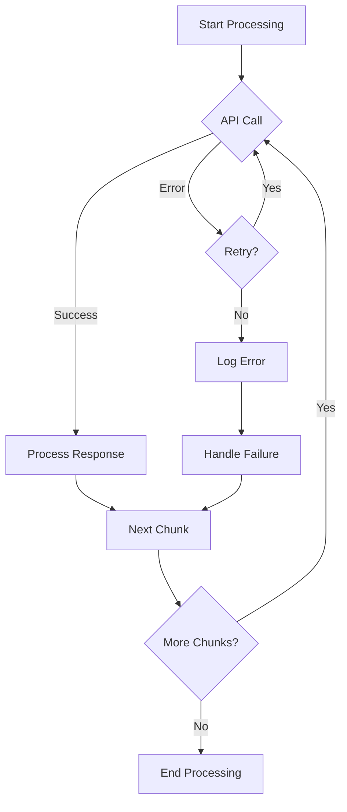

### 6.2 Error Classification

- **Input Validation Errors**: Invalid file formats, missing columns
- **API Errors**: Rate limits, authentication, timeouts
- **Processing Errors**: Token limits, malformed outputs
- **System Errors**: File I/O, memory issues

Each error type has specific handling strategies and recovery mechanisms.

## 7. Configuration Management

### 7.1 Configuration Loading Flow

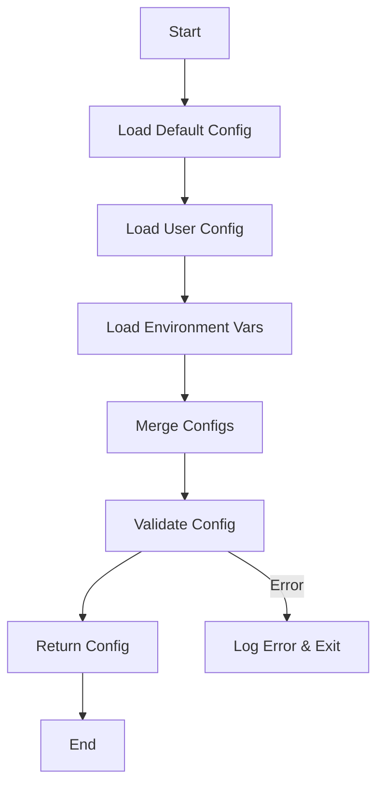

### 7.2 Configuration Layers

1. **Default Configuration**: Hardcoded defaults in `constants.py`
2. **User Configuration**: `config.yaml` in project root
3. **Environment Variables**: Override specific settings
4. **Command-Line Arguments**: Highest precedence

### 7.3 Configuration Schema

```yaml
# Example Configuration Structure
batch_processing:
  max_workers: 4
  chunk_size: 1000
  max_retries: 3

llm:
  model: gpt-4
  temperature: 0.7
  max_tokens: 2048

token_management:
  token_limit: 1000000
  cost_tracking: true

logging:
  level: INFO
  file: batch_grader.log
  max_size: 10485760 # 10MB
  backup_count: 5
```


