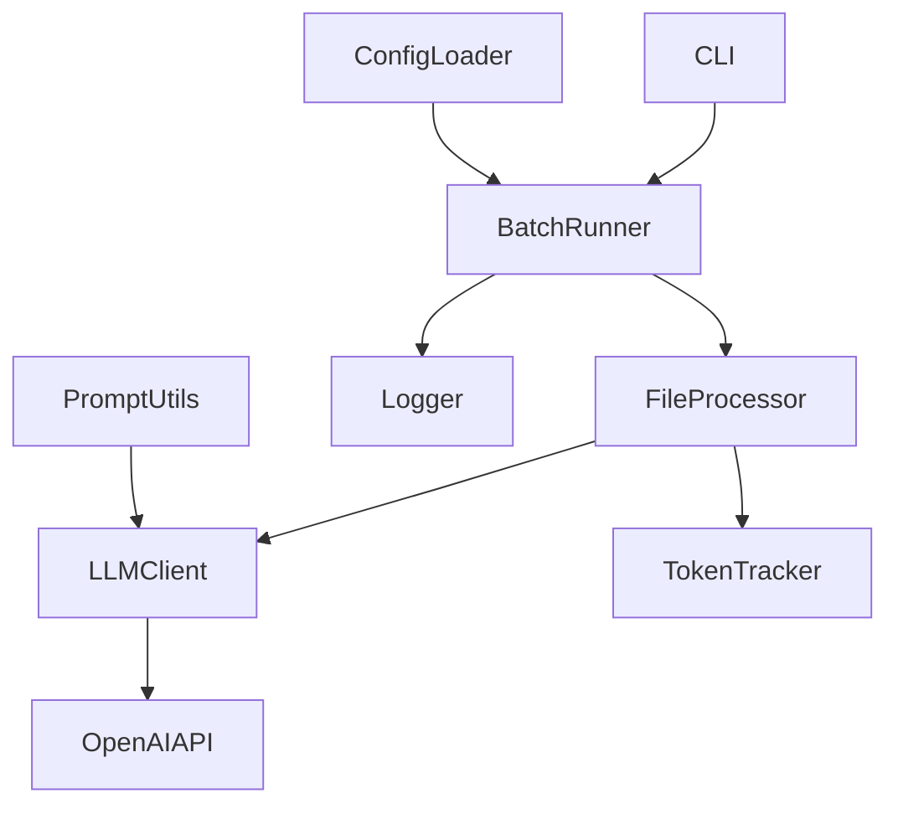
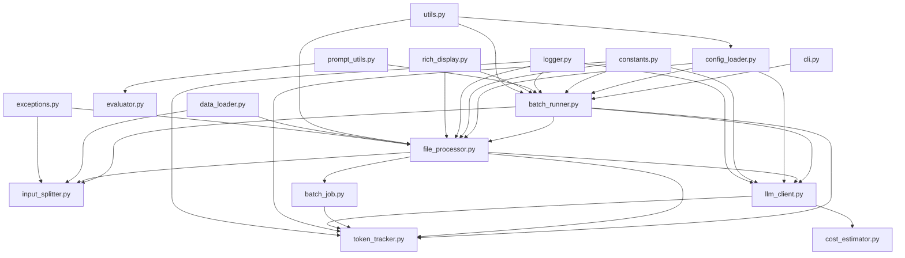
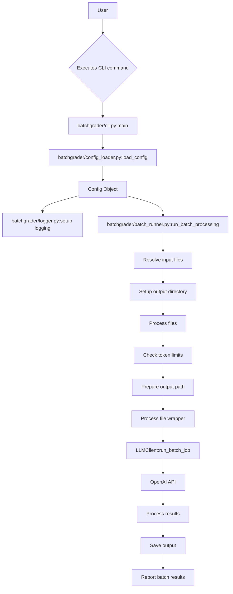
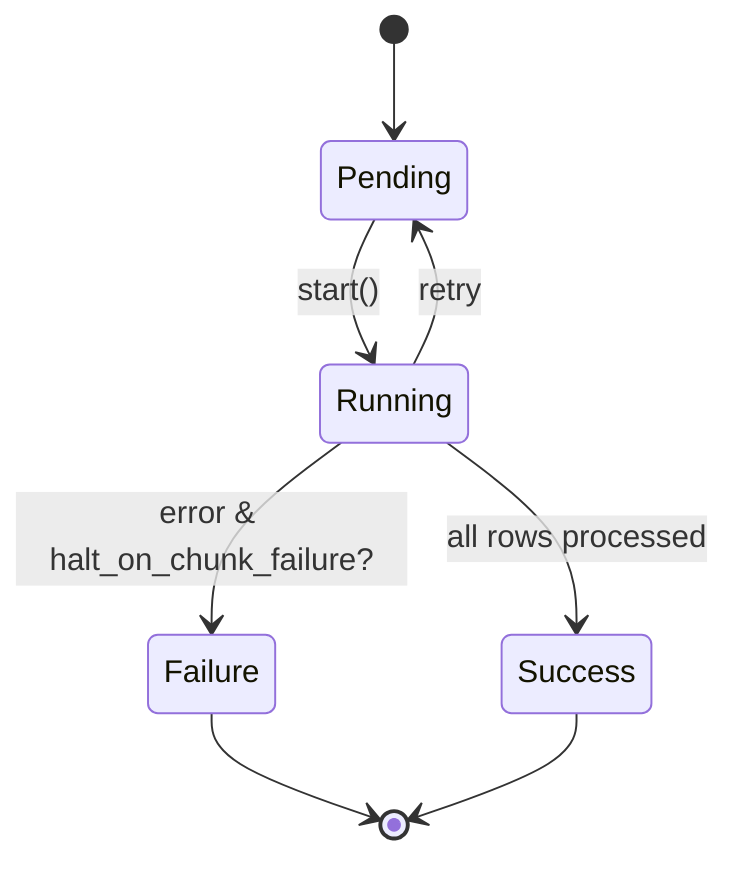
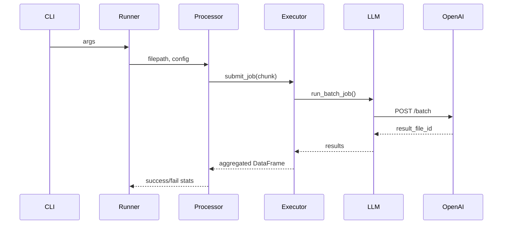

# BatchGrader Directory Restructure Plan

## System Overview

**High-level Description:**  
The BatchGrader system is a modular Python application designed for efficient batch processing of datasets through LLM APIs. It features robust configuration, error handling, and is architected for extensibility. The main entry point is a command-line interface (CLI), which orchestrates the workflow from configuration, through input splitting and LLM invocation, to results aggregation.

- **Entry Points:** CLI (`cli.py`), batch runner, and test suites.
- **Key Components:** Batch runner, file processor, LLM client, config loader, logger, token/cost tracker.
- **Major Subsystems:** Batch processing, evaluation, logging, configuration, and prompt utilities.
- **External Dependencies:** OpenAI, Tenacity, Pandas, Rich, PyYAML, and others as listed in `pyproject.toml`.

---

## Refactor Plan: Move to `src/batchgrader/` Layout

### 1. Create `src/batchgrader/`

- Add `__init__.py` to `src/batchgrader/` to make it a Python package.
- Remove `src/__init__.py` from the base directory; it is not needed with the new src-layout structure.

### 2. Move All Modules

- Move all `.py` files from `src/` (except `output/` and the old `__init__.py`) into `src/batchgrader/`.

### 3. Update Imports

- Change all `from src.module` and `import src.module` to `from batchgrader.module` or `import batchgrader.module`.
- Update all test and script imports.
- Adjust any relative imports to align with the new structure.

### 4. Update Poetry Config (`pyproject.toml`)

- Set `[tool.poetry] name = "batchgrader"`
- Add:

  ```python
  [tool.poetry.packages]
  include = "batchgrader"
  from = "src"
  ```

### 5. Verify Configuration and Scripts

- Ensure scripts, config files, and documentation reference the new package structure.

---

## Architectural Patterns

- **Design Patterns:** Modular codebase, separation of concerns, configuration-driven logic.
- **Communication Models:** Function/method calls and external API consumption (OpenAI Batch API and others).
- **Data Flow:** Input → Split → LLM Processing → Aggregation → Output.
- **State Management:** Stateless batch jobs; state managed in-memory and via output files/logs.

---

## Technical Diagrams

### System Architecture



### Component Relationships



### Data Flow



### State Transitions



### Execution Paths



---

## Critical Findings

- **Potential Issues:** All imports must be updated or code will break; test scripts need patching.
- **Architectural Concerns:** Refactor must be performed atomically to prevent partial states.
- **Performance/Security:** This refactor is architecture only; no direct impact.
- **Maintainability:** Improved by use of best practices and standard Python packaging.
- **Assumptions:** No hidden dependencies on `src.` imports; `output/` is not a Python package.

---

## Recommendations

- Complete the refactor as above.
- Update documentation and developer onboarding guidance.
- Ensure test runner config includes `src/` in `PYTHONPATH`.
- After refactor, regenerate architectural diagrams and update system documentation.

---
